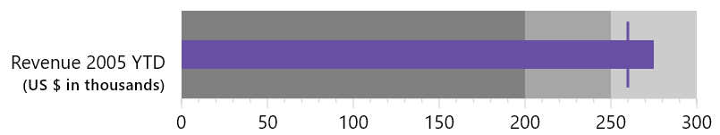
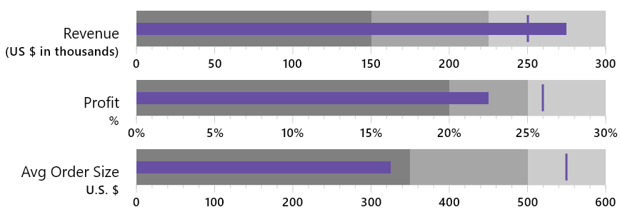

The bullet graph is a type of linear bar guage and is based on the [Perceptual Edge Bullet Graph Design Specification](http://www.perceptualedge.com/articles/misc/Bullet_Graph_Design_Spec.pdf).

The below example creates a single bullet graph with a two-line title.

{}

{}

It is common to use multiple bullet graphs together, and to ensure each is the same width and with labels aligned. That is possible using the BulletGraphs Composable as demonstrated below.

{}

{}
