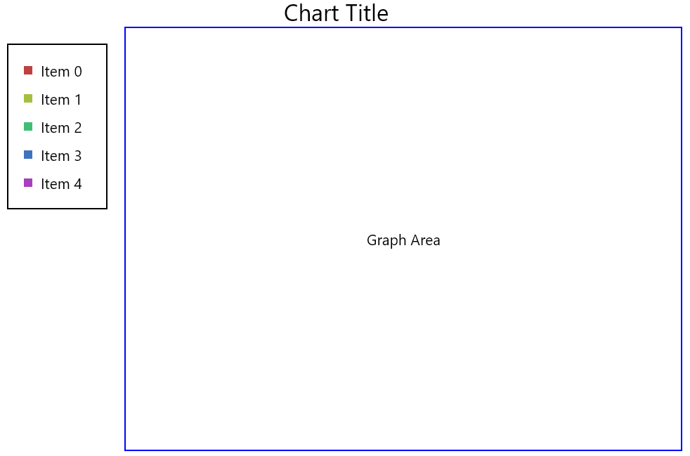
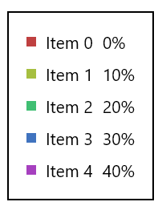
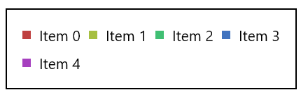

## Laying out Charts

ChartLayout is a simple aid for laying out the plot, a title, and a legend. The plot is the main content, with an optional legend that can be placed above, below, to the left, or to the right of it. A title is centered above the other content. ```ChartLayout``` has few options and expects the contained Composables to use padding and borders as preferred to achieve the desired look.

The below example illustrates how the components are placed relative to each other when the legend is placed to the left of the plot.

{}

{}

{}
By default charts will expand to fill all horizontal and/or vertical space available, and so if placed within a scrollable container must have a modifier applied that will limit their size.
{}

## Legends

To assist with generating legends, Koala Plot provides two Composables ColumnLegend and FlowLegend. The above example included an example of ```ColumnLegend```. It places a symbol, a label, and a value in rows, each aligned in columns. A ```ColumnLegend``` with all three
items in each row is included in the example below:

{}

{}

```FlowLegend``` is best used above or below the graph, and will expand to be as wide as necessary to fit its content. Once it reaches the maximum width allocated to it, it will place additional items on the next row. The below example demonstrates this wrapping feature when the available width is too small to hold all items in a single row:

{}

{}
