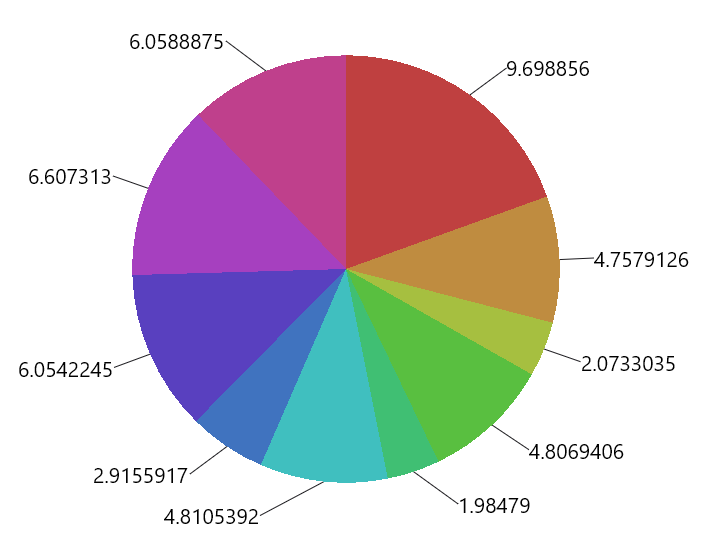
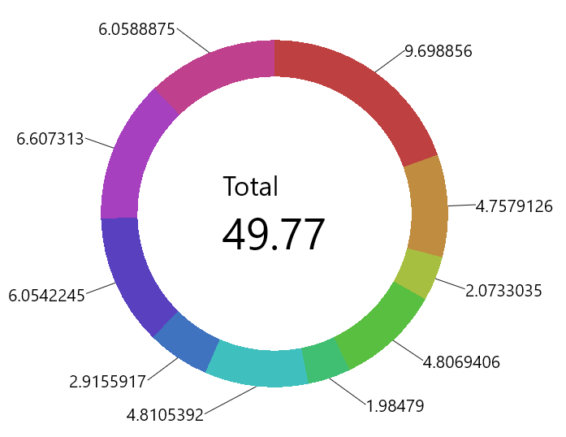

Pie and donut charts are essentially the same, except the donut chart has a hole in the middle and with Koala Plot you can put a Composable in that space.

The pie and donut chart take as their data a ```List<Float>```. Pie slices start at 12 O'Clock and go clockwise around the circult, starting at the first element of the list. Below is a simple example with 10 random values:

{}

{}

Each slice is scaled to be proportional to the total of all values.

There are many options for tailoring the visual appearance of the Pie Chart and a good way to quickly see their effect is by looking at the Pie Chart from the [web samples](https://koalaplot.github.io/koalaplot-samples/index.html).

By default, the pie chart will place slice labels around the outer perimeter of the pie in a circle, given sufficient space for the labels. If there isn't sufficient space, it will push the labels up or down so that they don't overlap each other. If you don't like this approach, the position of the labels is pluggable and can be customized by implementing the LabelPositionProvider interface and passing your implementation to ```PieChart()```.

## Donut Charts

The donut chart is the same in all ways as the pie chart except you can specify a "hole" size as a fraction of the overall pie diameter, and you can provide a Composable to display within the empty space. This is demonstrated below:

{}

{}
