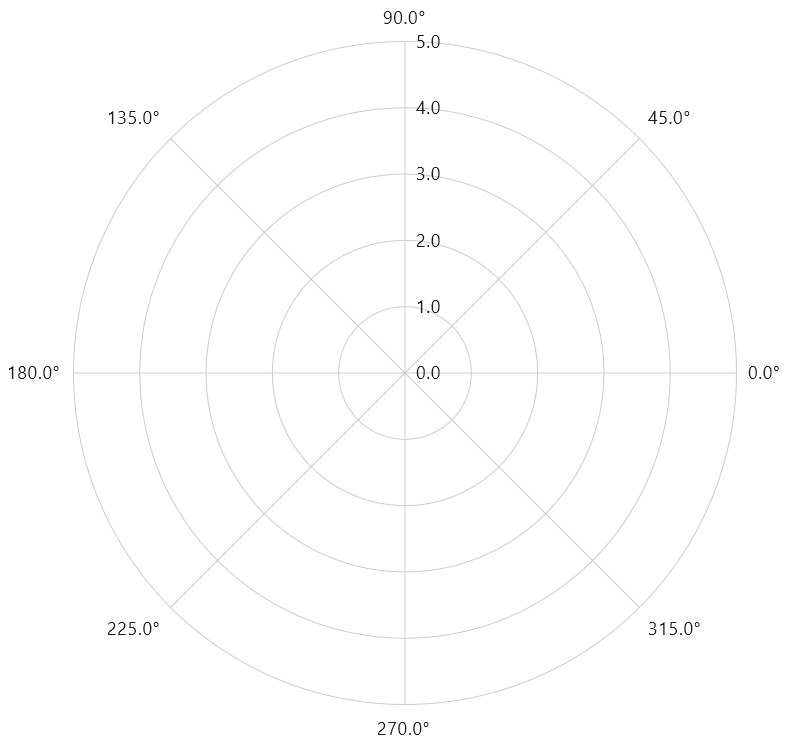
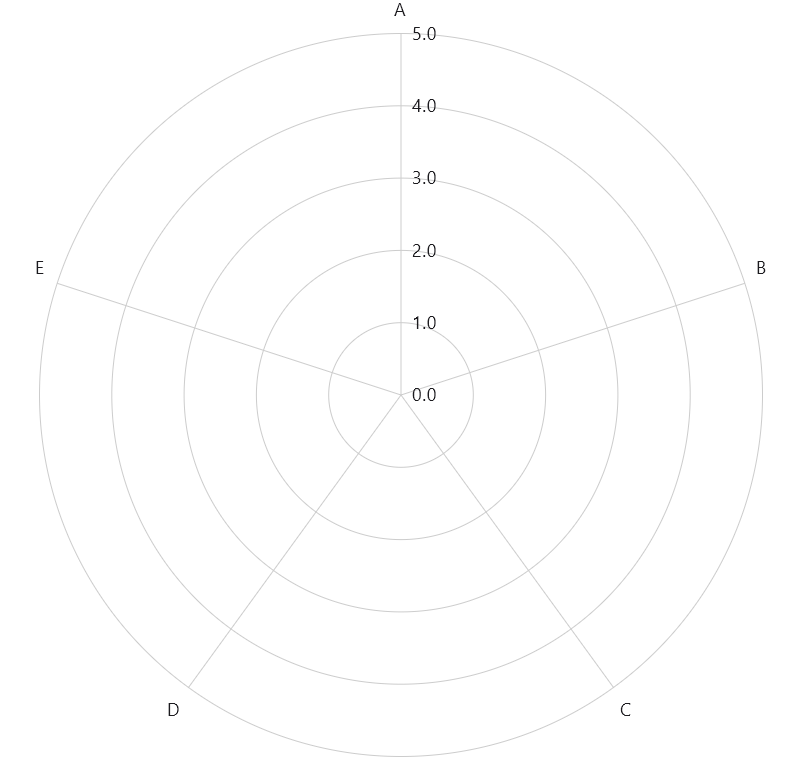
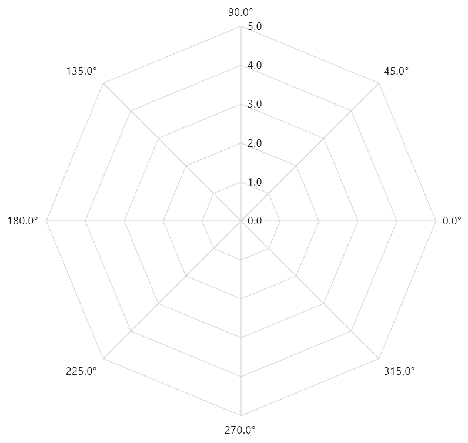
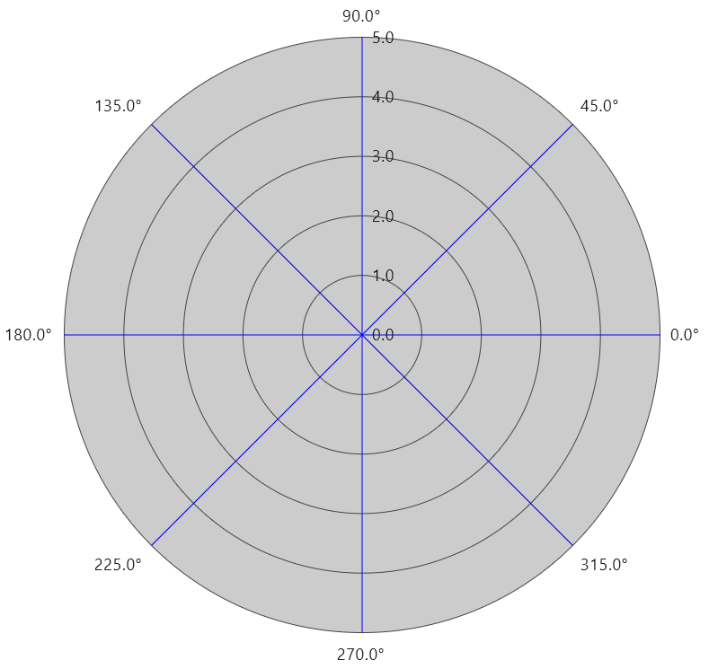
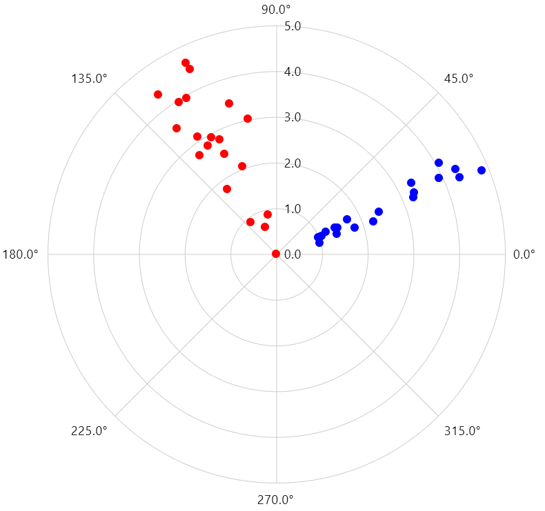
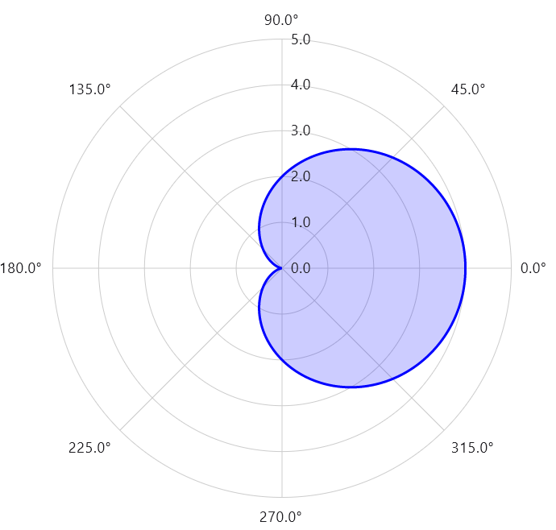

Polar, Radar, and Spider plots are different names for essentially the same thing: two-dimensional plots using a polar coodrinate system. In a 2-d polar coordinate system one axis is radial, measuring distance from the center of the graph, and the second axis is angular, measuring angle around a circle.

## Polar Graph

Analogous to the ```XYGraph``` for 2-d Cartesian plots, there is PolarGraph for creating the surface onto which polar plots can be composed. The below example illustrates a ```PolarGraph``` with mostly default configuration:

{}

{}

In this example the radial axis uses ```Float``` values, and the angular axis uses AngularValues, a sealed type that represents angular coordinates in degrees or radians and can transform between the two scales. The defaultAngularValueAxisModel produces ticks at every 45-degrees.

The angular axis can be any type that implements the AngularAxisModel interface. Koala Plot provides an implementation that uses a ```List``` of elements of an arbitrary type, CategoryAngularAxisModel, that places its elements evenly spaced around the circumfrence of the plot.

Below is an example using ```String``` as the category objects:

{}

{}

### Polar Graph Styling

The above examples draw the radial grid lines as concentric circles. An alternative is to draw them as straight lines between angular grid lines, as illustrated in the below example:

{}

{}

This cosmetic alternative is often referred to as a Spider Chart because of its resemblance to a spider web, but functionally it is identical to the polar graph from the first example.

Other key elements of the ```PolarGraph``` that can be styled include the axis lines and the background, as shown in the below example:

{}

{}

## Polar Plots

PolarPlotSeries is used within the ```PolarGraph``` to plot lines, symbols, areas, or any combination of the three. The below example demonstrates using symbols to create polar scatter plots of two data sets:

{}

{}


To plot lines and/or areas, specify the styling for each as parameters to the ```PolarPlotSeries``` as shown in the below example:

{}

{}

