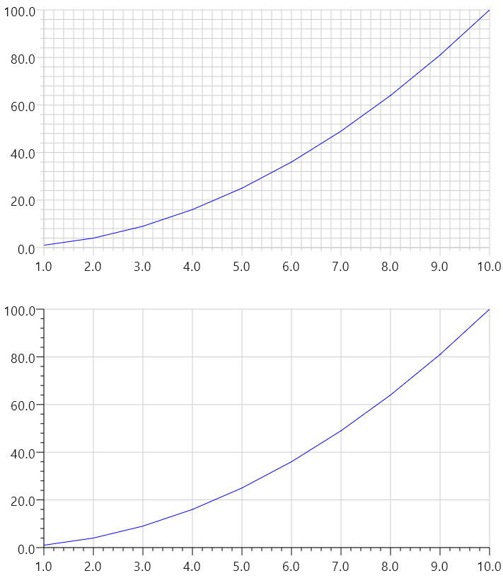

Use KoalaPlotTheme to customize default settings used for Koala Plot visual elements. Use it just like MaterialTheme: wrap your content in a  call to the Composable ```KoalaPlotTheme```, setting any function arguments desired.

The below exampleshows changing the color of the axes from light gray to black, and removing the rendering of minor ticks.

{}

{}


