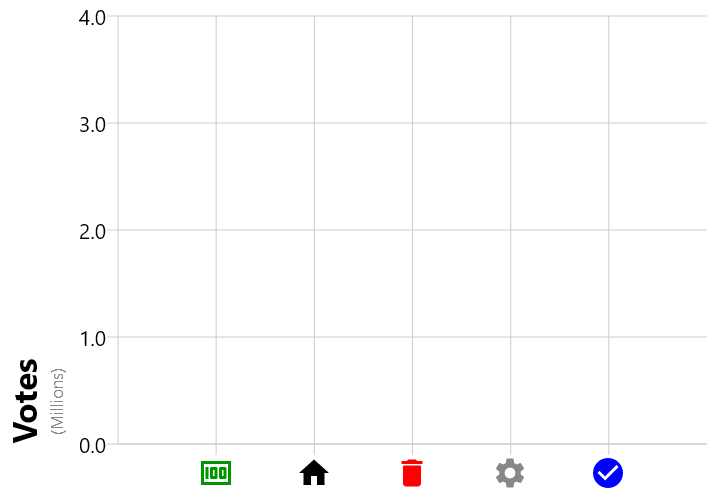

Line, Area, and Vertical Bars are each specific plot types that are graphed in 2-dimensional Cartesian coordinates. In Koala Plot, all of these plot types are composed within the XYGraph() function. This Composable provides several capabilities including:


- Holding the x-axis and y-axis models that transform coordinates between the plot space and screen space
- Rendering the axes
- Rendering background grid lines
- Rendering axis titles and labels
- Handling plot panning and zooming

This section will go step-by-step through how different XY Graph components can be customized, including specifying different axis types for linear, logarithmic, and category types.

## Anatomy of an XY Graph

The below diagram illustrates the major components of an XYGraph which can be customized.


## Gridlines

The gridlines in the above diagram used default settings for all elements except for the minor gridlines, which were modified by changing the theme as shown in the below code between lines 2 and 5.

{}

However, it is also possible to change the gridlines on an individual XYGraph, and separately for each gridline type.

{}

{}

The sample above uses the LineStyle class to set the style of each gridline type with different characteristics. By setting the style for a gridline to null, the gridlines will not be drawn, as seen for ```verticalMinorGridLineStyle```.


## Axes

Since an XYGraph provides a graphing area for 2-d Cartesian plots, it requires a model, an implementation of the AxisModel interface, for the x-axis (horizontal) and y-axis (vertical) axes. The AxisModel provides an abstraction for converting from the units in the space used for the plots to the space used for the graph. It also defines where major and minor ticks should be placed along the axis, and handles transforming the axis for zooming and panning. KoalaPlot includes three of the most comment types of axes:

- LinearAxisModel for using floating point values on a linear scale
- CategoryAxisModel for using lists of any type of object, e.g. Strings, as values
- LogAxisModel for using floating point values on a logarithmic scale

### LinearAxisModel

The simplest way to get a LinearAxisModel is to call the function rememberLinearAxisModel. This will create a LinearAxisModel and remember it for you.

#### Setting the Range

The range parameter to LinearAxisModel defines the minimum and maxiumum values that will be displayed by XYGraph for the axis. If data points extend beyond the specified range, they will be clipped and not displayed.

A good starting point for setting the range is the function autoScaleRange and its variants. An example of using ```autoScaleRange``` can be seen in the basic example of a [line plot]({}).

It is also possible to manually specify the range, for example:

{}

{}

Since the x-axis data in this example ranges from 1 to 10 and the y-axis data ranges from 1 to 100, both axes are slightly over sized, which is sometimes desired.

The previous example also illustrated how to control the number of minor ticks that are displayed between the major ticks: by specifying the ```minorTickCount``` parameter to ```LinearAxisModel```. 

### CategoryAxisModel

A CategoryAxisModel can use any data type for its values, and treats them as discrete values as opposed to LinearAxisModel which is continuous over its range. The below example uses Strings for the data type, with an ```XYGraph``` overload that renders the axis labels using the object's ```toString()``` method.

{}

{}

```CategoryAxisModel``` is simpler than ```LinearAxisModel``` and doesn't provide minor ticks, since the axis is discrete over the category values, or allow panning and zooming.

### LogAxisModel

LogAxisModel is continuous like ```LinearAxisModel``` but transforms its coordinates logarithmically from plot space to screen space. The below example illustrates using a logarithmic y-axis for plotting the function \\( y=x^2 \\). Note that the range for a ```LogAxisModel``` is specified as powers of 10, so this example uses a range from \\(10^{-1} = 0.1 \\) to \\(10^2 = 100\\)

{}

{}

```LogAxisModel``` can be used for either the x-axis and/or y-axis, enabling the creation of graphs where one or both axes use a logarithmic scale.


## Axis Styling

### Axis Titles & Labels

Axis titles and labels are provided by Composable functions as parameters to ```XYGraph```. That enables a high degree of customizability, since, for example, axis labels do not need to all be the same color, and can even be non-text items like images or icons, as shown in the following example.

{}

{}

In addition to using icons with varying colors for the x-axis labels, the above example also uses a custom ```AnnotatedString``` for the y-axis title.

### Axis Ticks & Lines

The sizes, and position of the ticks, as well as the color of each axis, can be individually configured by providing an AxisStyle to the ```XYGraph``` Composable, or through ```KoalaPlotTheme```. In this example we change the color, and set the length of the major and minor ticks to the same value:

{}

{}

## Annotations

Annotations are a way to place additional content within the graph area and in the axis coordinate spaces. Koala Plot provides three types of annotations:

- XYAnnotation to place any Composable content at a particular point within the graph area
- VerticalLineAnnotation to draw a vertical line at the specified x-axis coordinate
- HorizonalLineAnnotation to draw a horizontal line at the specified y-axis coordinate

The below example illustrates using all of these annotations.

{}

{}

The ```XYAnnotation```, in addition to a coordinate, also requires an anchor point. The anchor point defines the positioning of the composable relative to the specified coordinate. In the above example, ```AnchorPoint.BottomLeft``` was used, which causes the bottom left corner of the Composable to be placed at the specified coordinate, which in this example is the intersection of the red and blue lines.
