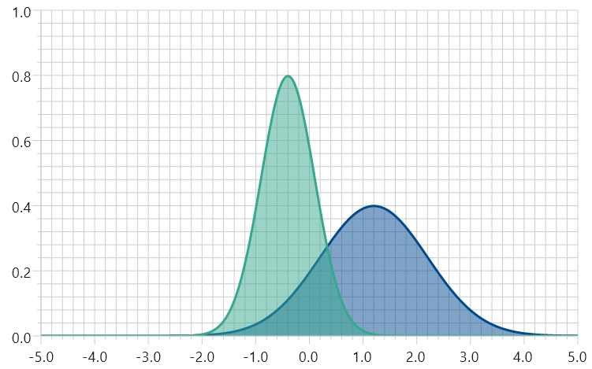
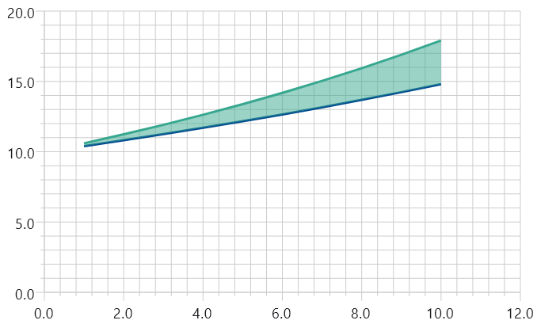
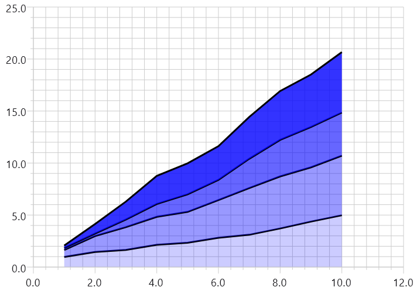

Area plots are like line plots but with a shaded area between the line being plotted and a second reference line, referred to as the Baseline. The Baseline can be either a horizontal line (constant y-axis value) or an arbitrary line, like another line on the same ```XYGraph```.

There are two ways to create an area plot:

- Using AreaPlot with an ```areaBaseline```, to plot 1 or more separate lines with filled areas
- Using StackedAreaPlot to plot multiple lines that stack on top of each other, with filled areas between them

## Plotting individual areas

The below example demonstrates plotting two separate area plots where the baseline is set to be the x-axis (horizontal line at which y=0). The lines are each plots of a normal distribution with different means and standard deviations.

{}

{}

Areas can also be plotted between two arbitrary lines. The below example plots the lines
\\(y = 10 \times 1.04^x\\) and \\(y= 10 \times 1.06^x\\) with a shaded area between them.

{}

{}

{}
The x-axis data values for each line do not have to be the same, however for
best results the first and last values should be the same, or the plot clipped by limiting the x-axis range.
{}

## Plotting stacked areas

A stack of area plots can be created by using multiple ```AreaPlot``` Composables within an XYGraph with appropriate choice of baselines. While this provides the most flexibility, it may not be the most convenient approach. For this reason Koala Plot provides StackedAreaPlot for the common situation where the first baseline is a horizontal line, typically the x-axis.

{}

{}

This example uses a ```List<Float>``` for the x-axis coordinates and a ```List<List<Float>>``` for the y-axis coordinates, created on line 9. It then uses StackedAreaPlotDataAdapter, which implements ```List<StackedAreaPlotEntry<Float, Float>>```, to present the source data in the form expected by ```StackedAreaPlot```. This is convenient if your data is already in the form of a list for the x-axis data points and a list of lists for the y-axis data points. If not, it will be necessary to directly implement the data as ```List<StackedAreaPlotEntry<X, Y>>``` or provide a custom adapter for it.
