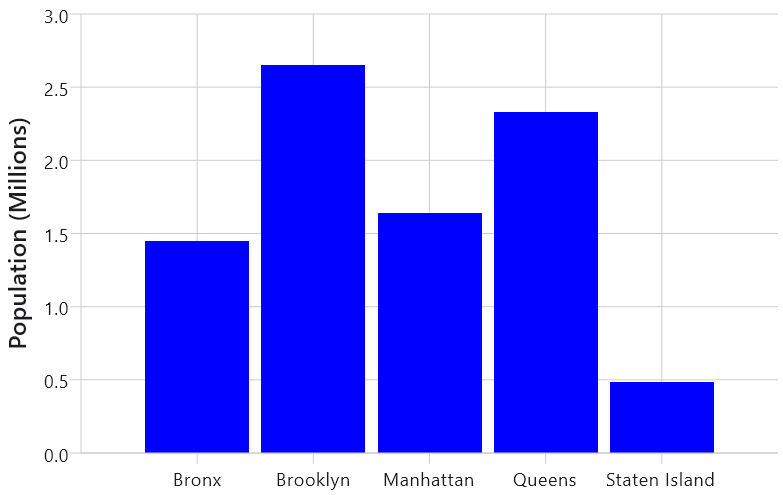
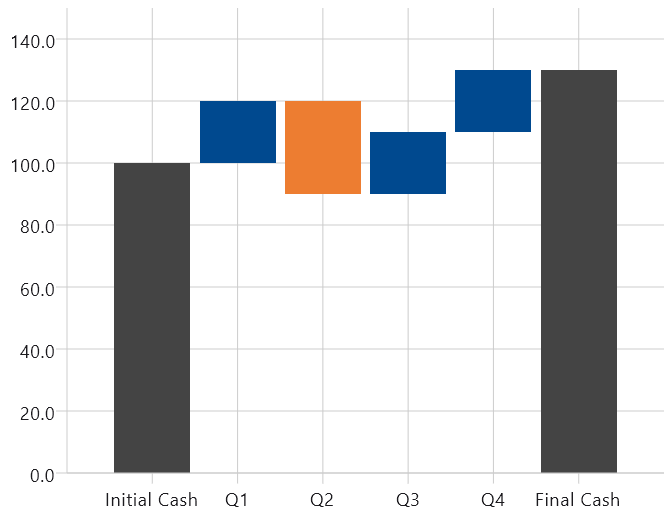
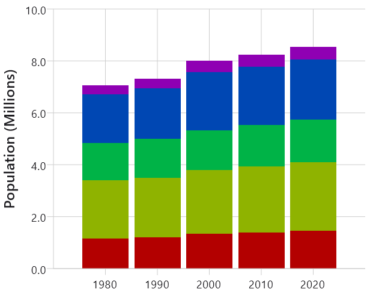
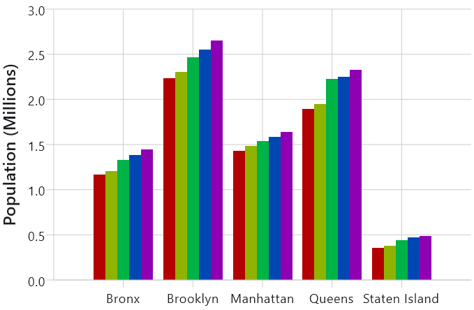

Bar Plots are also 2-D plots and are therefore plotted within an ```XYGraph``` parent. They are typically used with discrete data, and accordingly all of the examples on this page will use ```CategoryAxisModel``` for the x-axis. The y-axis can be of any data type, but the examples will all use ```LinearAxisModel```.

## Single Vertical Bar Plot

The simplest type of vertical bar plot has a single series of data, and there is a ```VerticalBarPlot``` overload to make this use case easy when using Float values for the y-axis. The below example demonstrates this to plot the population of each New York City burrough.

{}

{}

In the above example, all bars were automatically extended to the origin of the y-axis, 0. In some cases it is desirable to plot vertical bars with starting positions that are not at 0. To support this use case, there is a second form of ```VerticalBarPlot``` that allows specifying the starting and ending coordinates of each bar. The below example demonstrates using this flexibility to create a waterfall chart:

{}

{}

There is also a builder DSL for vertical bar plots, that slightly improves on the syntax. The previous example can also be implemented as follows:

{}

{}
For improved type safety, consider using an enumeration for the ```CategoryAxisModel``` categories. If an item is added with a category value that is not a member of the list provided to the ```CategoryAxisModel``` constructor, a runtime exception will be thrown.
{}

## Stacked Bars

A stacked bar chart consists of multiple series of data, each of which have data points at the same set of x-axis values. The bars for the data at each x-axis value accumulate and stack on top of each other to form a total. The below example demonstrates a stacked bar plot showing the population for each of the 5 New York City boroughs by year.

{}

{}

This example uses a StackedVerticalBarPlot overload that initiates a builder api for specifying the data series and items within each series. This builder will automatically accumulate the values in a stack, and is currently implemented only for vertical axes that use ```Float``` values. An alternative is to use the other variant of ```StackedVerticalBarPlot```, which is lower level but directly receives a List of the data regardless of types used, and requires the user to pre-accumulate the stack values.

## Grouped Bars

Like stacked bars, grouped bars also plot multiple series of data with a common set of x-axis values. However in grouped bars, each series is plotted side by side in a group centered on the common x-axis value for the group. The below example demonstrates creating a grouped vertical bar plot with Koala Plot.

{}

{}

Most of this example is establishing the data and the colors to use for each data series. The data series are the years, and the x-axis data values are the boroughs that make up the category axis. The key call is GroupedVerticalBarPlot which initiates a builder API for the plot. Within that api, ```series``` is used to add a new data series, which for this data are the years, and ```item``` is used to add an item to the series at a specific x-axis value and with minimum and maximum y-axis values for the corresponding bar, in this case the population data.

In this example, a unique Composable to generate a bar is provided for each series. It is also possible to specify a bar Composable for the individual item as well, if it should be rendered differently than the other bars in the series.

{}
There are two overloaded variants of ```GroupedVerticalBarPlot```. The api builder described above, and a lower level variant that takes all of the plot data in a single parameter. The builder api delegates to the second variant, and depending on the initial form of the data to be plotted one form may be more convenient than the other.
{}
