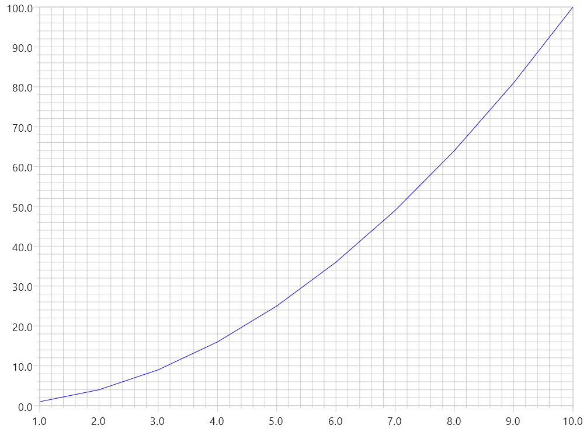
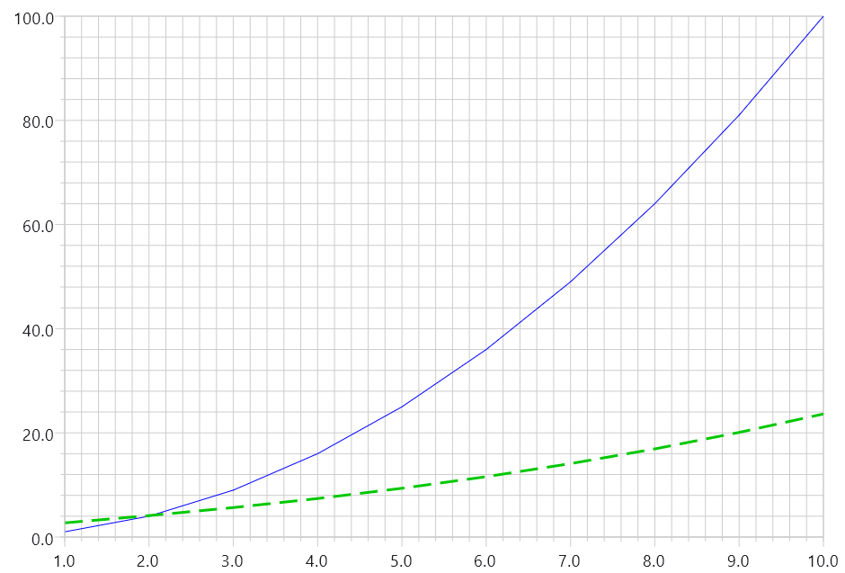
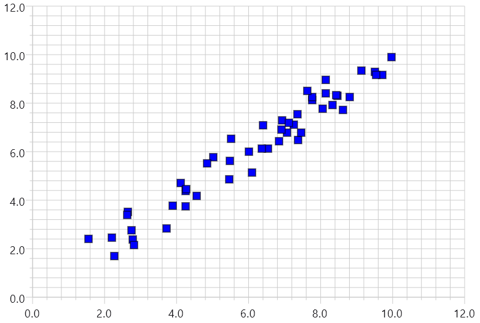
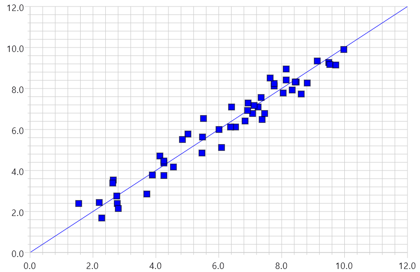
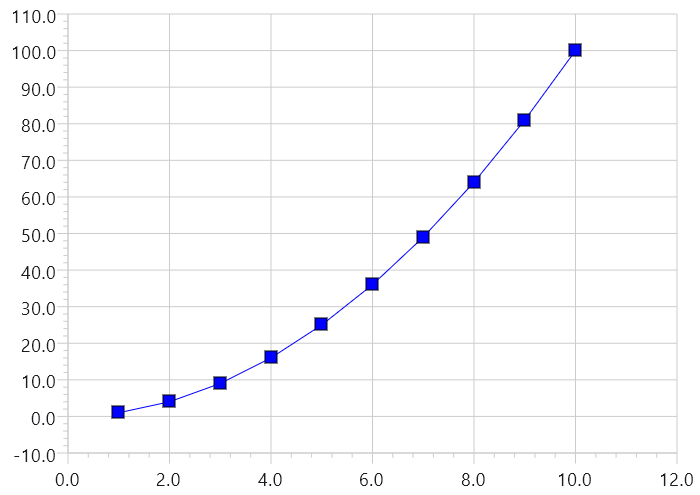

## Basics

A line plot requires a list of data points, (x, y) pairs, with the data type and in the coordinate system of the axes provided to the enclosing ```XYGraph```. As an example, we want to plot the function \\( y=x^2 \\) with x from 1 to 10 with two Float axes:

{}

{}

Lines 1-5 generate the data to plot. The data for Line plots is a list of x, y coordinates provided by an implementation of the Point interface. This example uses the provided implementation, DefaultPoint. 

Lines 8 and 9 provide an AxisModel for each of the x and y axes to XYChart. In this case, we are using linear axes with floating point values (other types are covered in [XY Graphs]({})) and ranges that are calculated with the
calls to ```autoScaleXRange()``` and ```autoScaleYRange()```.

Lines 11 through 13 call the ```LineChart``` Composable to render the line itself, using a solid blue style.

### Adding a Second Line

Now lets add a second line plotting the function \\( y=e^{\sqrt{x}} \\), which looks like this:

{}

{}

## Scatter Plots

A scatter plot is very similar to a line plot, and uses the same ```LinePlot``` Composable function, except instead of lines connecting data points a symbol is drawn at each data point. In Koala Plot, the symbols are themselves Composables, and to make it even simpler provides the Symbol Composable to make it easy to use a Shape with any fill and outline. Beyond the standard Compose circle and rectangle shapes, Koala Plot also defines additional shapes that are common for graphs, such as the TriangleShape and DiamondShape.

The below example illustrates a scatter plot using the default ```RectangleShape``` used by ```Symbol```.

{}

{}

## Combining Lines & Symbols

Combining lines and symbols on a single ```XYGraph``` is as simple as repeatedly using ```LinePlot``` for each data series to be plotted. The below example illustrates the scatter plot from the previous example, together with a plot of a line.

{}

{}

The z-order of the plots corresponds to the order in which they appear in the ```XYGraph```, so in this example the line is plotted first, and the rectangle symbols are plotted second and draw over the line.

It is also possible to plot both lines and symbols with the same ```LinePlot```, as illustrated below, which is a modification of the previous example plotting the function \\( y=x^2 \\).

{}

{}